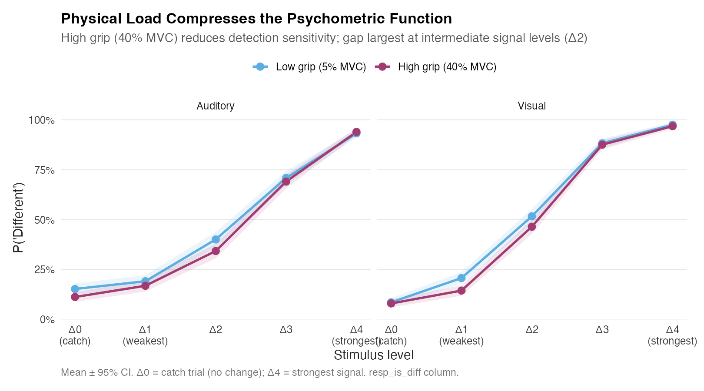
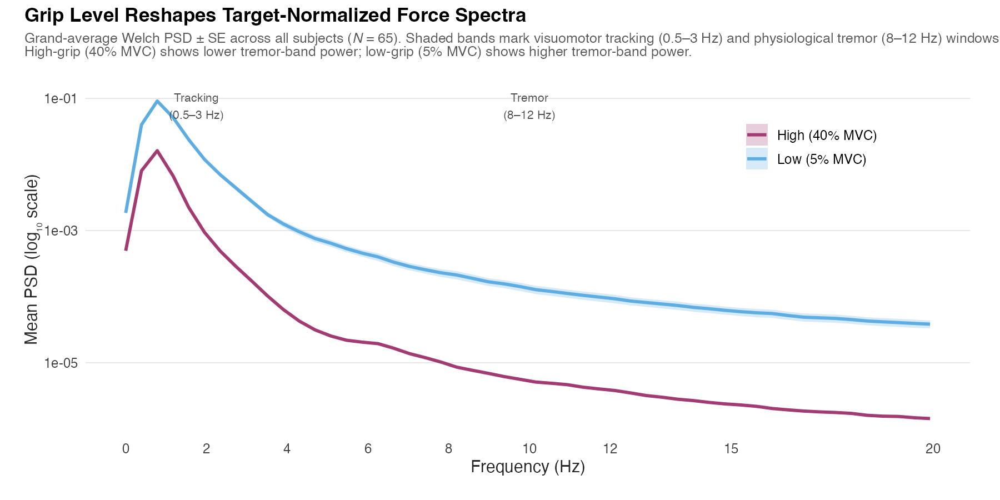

# Introduction {#sec-introduction}

Daily life rarely separates cognition from action. Older adults often have to sustain force while selecting, monitoring, or discriminating information: carrying groceries while checking traffic, gripping a railing while navigating a crowded space, opening medication packaging while reading dosage instructions, or holding a suitcase while searching for a gate sign. These situations are not simply motor tasks performed beside cognitive tasks. They are concurrent control problems in which the nervous system must regulate force, sensory evidence, attention, and response selection at the same time. This problem becomes more consequential in later life because aging is associated with declines in processing speed, executive control, sensory precision, and neuromodulatory regulation, all of which can reduce the capacity to manage simultaneous physical and cognitive demands [@craik1982; @hasher1988; @salthouse1991theoretical; @verhaeghen2003; @gazzaley2005top].

The dual-task literature has long shown that cognitive and motor demands interact in aging. Older adults show greater performance costs when walking while remembering, maintaining posture while performing a cognitive task, or coordinating fine motor output while holding information in working memory [@lindenberger2000balance; @li2001aging; @doumas2009; @hausdorff2008dual; @plummer2011; @plummer2012effects; @voelcker2007dual]. These effects are often interpreted as evidence that motor control and cognition draw on partially shared executive resources. The implication is straightforward but important: motor behavior in older adulthood cannot be treated as purely peripheral, and cognitive performance cannot be fully understood when the physical state of the body is ignored. Even a simple sustained contraction may alter the resources, arousal state, and control processes available for perceptual decision-making.

Most cognitive-motor aging studies have focused on gait, balance, or posture. These paradigms are highly relevant for fall risk and functional mobility, but they do not exhaust the range of everyday physical-cognitive demands. Many daily actions are stationary rather than locomotor. A person may need to hold a bag, grip a steering wheel, stabilize a handrail, squeeze a bottle cap, or maintain force on an object while simultaneously interpreting sensory information. Isometric handgrip provides a controlled way to study this class of behavior. It allows physical effort to be scaled to each participant's own maximum voluntary contraction, minimizes whole-body movement, and can be used in constrained environments such as MRI scanning. It also has ecological relevance because power grip is involved in many everyday actions requiring sustained force. Unlike gait or postural control, handgrip permits direct measurement of the force signal with high temporal resolution, allowing the motor task itself to become a continuous behavioral readout rather than a binary manipulation.

A central distinction for the present study is the difference between trait-level motor capacity and online motor regulation. Maximum voluntary isometric contraction, or MVIC, captures a relatively stable between-subject measure of grip strength. Grip strength has been widely used as an index of neuromuscular health and physical frailty in older adults [@bohannon2001; @vandervoort2002; @chainani2016; @dudzinska2017]. Although grip strength partly reflects peripheral muscle properties, it is also shaped by neural factors involved in force generation, coordination, and motor control [@enoka1988; @seidler2010motor; @chong2024]. Recent work from our group extended this framework by using connectome-based predictive modeling to show that task-based functional connectomes can predict individual differences in MVIC in older adults, with subcortical and cerebellar networks playing an important role in the prediction of grip strength [@ghaffari2025connectome]. That work established MVIC as a meaningful trait-like marker linked to distributed brain organization.

However, a stable force ceiling does not answer a different question: how does the aging brain regulate force from moment to moment while a concurrent cognitive decision is unfolding? MVIC tells us how hard a person can squeeze. It does not tell us whether the person can hold a target force smoothly, whether the force signal destabilizes when perceptual evidence becomes difficult, or whether subtle oscillations in force output predict cognitive failure on the same trial. These are process-level questions. They require analysis of continuous motor dynamics rather than static motor capacity. This distinction is especially important in aging because an older adult may show preserved maximum strength but still struggle with the online regulation of force under cognitive load. Conversely, a participant with lower MVIC may maintain stable force if the motor-control loop remains well regulated. The present study therefore shifts the focus from grip strength as a between-subject trait to grip-force dynamics as an online signal of cognitive-motor strain.

Two theoretical frameworks motivate this shift. The first is Resource Competition theory. In its classic form, capacity models propose that attention and cognitive control depend on a limited pool of processing resources that must be allocated across concurrent demands [@kahneman1973; @navon1979; @wickens2008]. When two tasks are performed at once, performance costs arise because both tasks require access to overlapping resources. Maintaining handgrip force is not just a muscular event. It requires sustained goal maintenance, visual feedback monitoring, error correction, and descending motor control. Perceptual discrimination similarly requires sensory encoding, evidence accumulation, response selection, and often the suppression of irrelevant information. Under low physical and cognitive demand, these operations may proceed in parallel with little cost. Under high physical load and high perceptual difficulty, however, the combined demand may exceed the available control capacity, especially in older adults who already operate closer to processing limits [@craik1982; @salthouse1991theoretical; @verhaeghen2003].

Resource Competition theory also highlights why aging should amplify cognitive-motor interference. Older adults often show reduced efficiency in allocating attention across competing inputs and weaker suppression of irrelevant information [@hasher1988; @gazzaley2005top]. Inhibitory-control deficits are especially relevant because concurrent physical effort may increase the need for control at the same time that the perceptual task requires discrimination of subtle sensory differences. A central-resource account would therefore predict that increasing physical effort should reduce the resources available for perceptual evidence accumulation and decision formation. It would also predict that force regulation itself may suffer when attention is withdrawn from the motor loop. From this perspective, instability in grip force is not a nuisance artifact. It is a measurable expression of resource reallocation under concurrent demand.

The second framework is the locus coeruleus–norepinephrine Adaptive Gain account. The LC-NE system regulates arousal, attention, and neural gain by modulating the responsiveness of cortical and subcortical processing systems [@astonjones2005; @sara2009; @mather2016; @mather2016neural; @joshi2020]. Gain modulation changes the signal-to-noise properties of neural processing by amplifying strongly activated representations and suppressing weaker activity patterns [@servan1990]. In adaptive conditions, phasic LC-NE responses can sharpen processing and support task engagement. But the same system can become maladaptive when arousal is too high, too tonic, or poorly regulated. This logic follows the long-standing inverted-U relation between arousal and performance, in which moderate arousal can improve performance but excessive arousal degrades it [@yerkes1908; @astonjones2005].

Effortful muscular contraction is a plausible route into this arousal system. Isometric handgrip can increase sympathetic activation, cardiovascular response, and noradrenergic engagement, making it useful for manipulating arousal without requiring locomotion [@zenon2014; @nielsen2015; @mather2020]. Under moderate load, this arousal increase may improve processing speed or readiness. Under high load, especially when paired with difficult perceptual decisions, arousal may push the system beyond its optimal operating range. In aging, this possibility is particularly important because the LC-NE system is vulnerable to structural and functional changes across later life, and age-related alterations in arousal regulation may affect both perception and cognitive control [@mather2016; @ross2020; @huang2024]. Thus, the same physical effort that increases alertness in one context may destabilize performance in another.

Recent handgrip studies support this dual-mechanism view. @park2021 found that visual search under high physical effort was faster but more vulnerable to distractor interference. This pattern is theoretically informative because it suggests that effort-induced arousal can speed some aspects of processing while simultaneously weakening top-down inhibitory control. @azer2023 extended this logic to aging by showing that effortful handgrip impaired older adults' working-memory performance when distractors were present, consistent with the view that older adults are especially vulnerable when physical effort and cognitive control demands converge. Together, these studies argue against a simple account in which physical effort is uniformly beneficial or uniformly harmful. Instead, physical effort appears to alter both arousal and control. Whether the observed effect is positive, negative, or mixed depends on load, task demands, age, and the specific behavioral measure being analyzed.

This distinction matters for the present study because perceptual decision-making is not a single process. Auditory and visual discrimination require the nervous system to compare a standard stimulus with a probe stimulus, detect whether a change occurred, and commit to a same/different response. As stimulus similarity increases, evidence becomes weaker and the decision becomes more demanding. In this context, high physical effort may interfere with perception through at least two routes. A Resource Competition mechanism would predict that force maintenance competes with perceptual evidence accumulation for central resources. An Adaptive Gain mechanism would predict that effort-induced arousal changes the neural signal-to-noise ratio, potentially improving processing at moderate levels but impairing discrimination when combined demand becomes too high. These mechanisms are not mutually exclusive. They may operate together, and their combined expression may be visible in the motor signal itself.

Isometric grip control is especially well suited for detecting this interaction because maintaining a target force is an active closed-loop process. Participants must continuously compare current force with the target, adjust motor output, and suppress deviations from the desired force level. These adjustments depend on sensory feedback, motor prediction, corticospinal output, subcortical regulation, and cerebellar error correction. Neural systems involved in force production and relaxation include motor, premotor, basal ganglia, and cerebellar circuits [@spraker2009; @seidler2010motor]. Grip-force tracking is also sensitive to feedback precision and task constraints [@sterr2009]. As fatigue or effort increases, force output can become more variable and less stable, reflecting changes in both peripheral neuromuscular state and central motor drive [@missenard2008; @morrison2005; @taylor2008].

For this reason, whole-trial averages are too blunt for the current question. Mean force can confirm whether participants generally squeezed near the target, but it cannot reveal how force control fluctuated around the moment of perceptual challenge. Similarly, average absolute error collapses across distinct sources of motor variability. A participant may show slow corrective drift, high-frequency tremor, or both; these patterns may have different physiological meanings. Frequency-domain analysis allows us to separate these components. By treating the 100 Hz dynamometer stream as a continuous time series, we can examine the spectral structure of force deviations within each trial and ask whether specific oscillatory features predict perceptual performance.

The present study focuses on two engineered frequency bands with distinct biophysical interpretations. The first is a low-frequency visuomotor tracking band from 0.5 to 3.0 Hz. Power in this range captures slower corrective adjustments around the target force. These fluctuations likely reflect the participant's ongoing attempt to maintain the target centerline using visual feedback and voluntary motor correction. A reduction in this band after stimulus presentation may indicate a withdrawal of attention from the motor-control loop, as resources are redirected toward perceptual evidence accumulation. In other words, a collapse in tracking-band power may signal that the participant is no longer actively correcting force output with the same degree of moment-to-moment control.

The second band is a high-frequency physiological tremor band from 8.0 to 12.0 Hz. Power in this range is expected to capture faster oscillatory components of the force signal associated with physiological tremor, neuromuscular fatigue, and arousal-linked motor instability. This band is theoretically important because it may reflect the somatic cost of combined physical and cognitive demand. If high physical effort increases sympathetic arousal and destabilizes motor output, then tremor-band power may be elevated under conditions of greater strain. Accordingly, if tremor elevation reflects a partial breakdown of concurrent-demand regulation, it may carry incremental information about trial-level perceptual outcomes beyond nominal task labels such as grip level or stimulus difficulty.

A key methodological issue is that low-effort and high-effort grip trials should not be assumed to reflect the same motor regime. At 5% MVC, participants are close to the lower bound of voluntary force production, where small precision adjustments and target-normalization effects can dominate the measured signal. At 40% MVC, participants are under meaningful physical strain, and the same spectral features are more likely to reflect effort-linked motor instability. Pooling low- and high-grip trials can therefore mix qualitatively different sources of variance. This is not only a statistical concern. It is a theoretical concern. If low-effort precision noise and high-effort somatic instability are collapsed into a single model, the resulting coefficient may obscure the very cognitive-motor interaction the study is designed to detect. For that reason, the present study treats grip level as defining distinct motor-control regimes and places primary inferential emphasis on the high-effort condition, where tremor-band dynamics are most directly interpretable as a marker of physical-cognitive strain.

This stratified approach also addresses a broader limitation of nominal task designs. Traditional dual-task analyses often compare low versus high physical effort and low versus high cognitive effort, then ask whether the interaction predicts mean accuracy or reaction time. That approach is useful, but it treats effort as an external label rather than an observed physiological process. Two participants assigned to the same 40% MVC condition may show different levels of force stability, tremor, fatigue, and corrective control. Even within the same participant, some trials may be regulated smoothly while others show transient destabilization. Continuous grip-force sensing makes it possible to move beyond the nominal condition label and measure the state of the motor system on each trial.

The present study asks whether sub-second fluctuations in concurrent grip-force control can be resolved at the single-trial level during perceptual decision-making, and whether those fluctuations carry incremental information about accuracy beyond nominal task difficulty labels. We examine older adults performing auditory and visual standard-probe perceptual discrimination tasks while maintaining either low or high isometric handgrip force. Rather than reducing grip performance to a trial average, we extract event-locked force dynamics from the continuous dynamometer stream and quantify spectral power in the visuomotor tracking and physiological tremor bands. We then test whether these motor features explain perceptual accuracy after accounting for task difficulty and subject-level structure—under conditions where difficulty and between-subject baselines are expected to dominate variance.

We advance two primary hypotheses, both framed as trial-level comparisons given our epoch design, which spans grip-cue onset through the post-probe window rather than isolating post-probe dynamics. The **Visuomotor Tracking Hypothesis** predicts that power in the 0.5–3.0 Hz tracking band will be reduced on difficult trials, consistent with withdrawal of attentional resources from the motor-control loop during demanding perceptual discrimination. The **Tremor Instability Hypothesis** predicts that, under high physical strain, higher power in the 8.0–12.0 Hz tremor band will be associated with perceptual failure on the same trial, supporting the interpretation that trial-level force instability carries incremental information about cognitive-motor strain above and beyond nominal task difficulty. Primary inference is organized around the high-effort arm; the low-grip arm serves as a specificity comparison to test whether any observed association is unique to high-effort motor control or reflects a more general motor state variable.

To test these hypotheses, we analyze a cohort of older adults who completed auditory and visual perceptual discrimination challenges while producing handgrip force scaled to their own MVIC. The task design parametrically varied perceptual difficulty, allowing accuracy to be modeled across graded stimulus conditions rather than only coarse difficulty bins. The analytic pipeline uses target-normalized force error, event-locked windowing, frequency-domain feature extraction, and mixed-effects models with subject-level structure. Because the central question is whether subtle motor dynamics can be parsed at all under strong task constraints, we pair in-sample mixed-effects models with subject-wise cross-validated prediction. This structure asks whether force features generalize beyond participant-level baselines—not whether they overwhelm the psychometric effects of stimulus difficulty.

The contribution of this study is therefore threefold. First, it extends prior work on grip strength and frailty by moving from trait-level MVIC to online force-control dynamics. Second, it links Resource Competition and Adaptive Gain accounts by treating continuous motor instability as a potential behavioral trace of both resource reallocation and arousal dysregulation. Third, it introduces a stratified signal-processing framework for testing when high physical effort may transform grip-force tremor into a trial-level marker of perceptual strain—a question that requires separating load-induced instability from low-effort precision noise. In doing so, the study reframes the dynamometer from a device used only to impose physical effort into a high-frequency behavioral measure for probing subtle cognitive-motor coupling, even when that coupling is small relative to task difficulty.

# Materials and Methods {#sec-methods}

```{r}
#| label: sample-counts
#| echo: false
#| message: false

report_dir <- normalizePath("../reports", winslash = "/", mustWork = FALSE)
trial_path <- file.path(report_dir, "analysis_trial_table.csv")

if (file.exists(trial_path)) {
  df <- read.csv(trial_path, stringsAsFactors = FALSE)
  n_subjects  <- length(unique(df$subject_id))
  n_trials    <- format(nrow(df), big.mark = ",")
  n_high_grip <- sum(tolower(as.character(df$is_high_grip)) %in% c("true", "1"), na.rm = TRUE)
  n_low_grip  <- sum(tolower(as.character(df$is_high_grip)) %in% c("false", "0"), na.rm = TRUE)
  age_mean    <- 69.5
  age_sd      <- 6.4
  pct_female  <- 50.0
  txt_n_subjects <- n_subjects
  txt_n_trials   <- n_trials
  txt_age_mean   <- sprintf("%.1f", age_mean)
  txt_age_sd     <- sprintf("%.1f", age_sd)
  txt_pct_female <- sprintf("%.0f", pct_female)

  # Spectral outlier exclusion counts (used in Methods behavioral-exclusions paragraph)
  # z-scores computed within each grip arm (matching the prep() function in results-stats)
  ok_cols <- !is.na(df$resp_is_correct) & !is.na(df$pow_05_3hz) & !is.na(df$pow_8_12hz)
  df_clean <- df[ok_cols, ]
  df_clean$pow_8_12hz_z <- ave(df_clean$pow_8_12hz, df_clean$is_high_grip,
                                FUN = function(x) (x - mean(x)) / sd(x))
  n_excl_high <- sum(abs(df_clean$pow_8_12hz_z[tolower(as.character(df_clean$is_high_grip)) %in% c("true","1")]) > 3.5, na.rm = TRUE)
  n_excl_low  <- sum(abs(df_clean$pow_8_12hz_z[!tolower(as.character(df_clean$is_high_grip)) %in% c("true","1")]) > 3.5, na.rm = TRUE)
  n_excl      <- n_excl_high + n_excl_low
  n_total_clean <- nrow(df_clean)
  txt_n_spectral_excl      <- format(n_excl, big.mark = ",")
  txt_n_spectral_excl_high <- format(n_excl_high, big.mark = ",")
  txt_n_spectral_excl_low  <- format(n_excl_low, big.mark = ",")
  txt_pct_spectral_excl    <- sprintf("%.1f", 100 * n_excl / n_total_clean)
} else {
  n_subjects  <- 66
  n_trials    <- "~3,700"
  n_high_grip <- "~1,850"
  n_low_grip  <- "~1,850"
  age_mean    <- 69.5
  age_sd      <- 6.4
  pct_female  <- 50.0
  txt_n_subjects <- n_subjects
  txt_n_trials   <- n_trials
  txt_age_mean   <- sprintf("%.1f", age_mean)
  txt_age_sd     <- sprintf("%.1f", age_sd)
  txt_pct_female <- sprintf("%.0f", pct_female)
  txt_n_spectral_excl      <- "37"
  txt_n_spectral_excl_high <- "23"
  txt_n_spectral_excl_low  <- "14"
  txt_pct_spectral_excl    <- "~0.3"
}
```

## Participants and procedure

Seventy older adults were recruited from communities surrounding the University of California, Riverside through mail, flyers, social media, and word-of-mouth. Inclusion criteria required participants to be between 60 and 90 years of age, have normal hearing and normal or corrected-to-normal vision, and be able to understand English well enough to follow task instructions. Participants were required to be right-handed and free of MRI contraindications, psychotropic medications, significant neurological conditions, and major health conditions such as diabetes. An a priori power analysis using G\*Power 3.1 [@faul2007] indicated that a sample of 34 participants would provide 80% power (α = .05) to detect a medium within-subject effect (*f* = 0.25) in a repeated-measures design with two grip levels and an assumed correlation of 0.5. Two participants were removed prior to analysis — one for a possible diagnosis of mild cognitive impairment and one for a possible diagnosis of essential tremor — leaving a behavioral sample of 66 participants. Additional trial-level data cleaning (described below) left a final sample of `{r} txt_n_subjects` participants who completed both tasks (mean age = `{r} txt_age_mean` years, *SD* = `{r} txt_age_sd` years; `{r} txt_pct_female`% female). All participants provided written informed consent and were compensated. All procedures were approved by the University of California, Riverside Institutional Review Board. The study was not pre-registered.

The present grip-force spectral analysis is restricted to participants for whom continuous dynamometer recordings were of sufficient quality and duration for frequency-domain decomposition. After applying grip-adherence and signal-quality screens described below, the analytic sample comprised `{r} txt_n_subjects` participants contributing `{r} txt_n_trials` analysis-ready trials across the auditory and visual tasks. Full demographic characteristics are reported in @sun2026modulation.

Participants completed four sessions. Sessions 1, 2, and 3 were conducted on separate days in the laboratory; Session 4 was administered remotely via tablet and contained neuropsychological assessments not reported here. **Session 1** introduced the tasks and established each participant's maximum voluntary contraction (MVC). Participants first watched instructional videos for the auditory and visual tasks without grip and completed at least 60 practice trials per task. MVC was measured using three 5-second maximum squeezes with approximately 30 seconds of rest between trials; the mean force across the three trials was taken as MVC. Individual target forces were set at 5% MVC (low grip) and 40% MVC (high grip). Participants then practiced both tasks with grip cues and confidence ratings included, and received corrective feedback if grip targets were not met. **Sessions 2 and 3** each consisted of one task performed inside the MRI scanner (functional MRI data are not reported here), with task order counterbalanced across participants. MVC was re-measured at the start of Session 2 inside the scanner, and this value was used to normalize target grip force for both scanning sessions. Participants completed a short practice block outside the scanner before each scanning session, followed by five blocks of 30 trials per task.

## Task design and apparatus

Participants performed separate auditory and visual same/different perceptual discrimination tasks. On each trial, a standard stimulus and a probe stimulus were presented in succession, and participants judged whether the two stimuli were the same or different; they then provided a retrospective confidence rating on a 4-point scale (1 = low, 4 = high). The task structure is illustrated in @fig-paradigm.

**Trial structure.** Each trial began with a 1.5–4.5 s jittered blank screen, followed by a 3 s display of a grip gauge instructing either low (5% MVC) or high (40% MVC) effort, with a color-coded fill providing real-time feedback (green = acceptable range, yellow = slight deviation, red = major deviation). A 0.25 s blank and a 0.5 s fixation dot preceded the stimuli. The standard stimulus was presented first, followed by a 0.5 s interstimulus interval (ISI), then the probe. Total trial duration was approximately 10.7 s. After probe offset, participants released the grip and had 3 s to report same or different (right index finger = "different," right middle finger = "same"), followed by a 3 s confidence rating window. Grip level was varied pseudorandomly across trials in equal proportions.

**Auditory task.** The standard stimulus was a 0.1 s sinusoidal tone at 1000 Hz. The probe was either identical to the standard (0 Hz offset) or positively offset by 8, 16, 32, or 64 Hz.

**Visual task.** The standard was a centrally presented sinusoidal grating (Gabor patch) at 1.5 cycles per degree, Michelson contrast 0.2, and 4 degrees of visual angle. The probe was either identical or positively offset in contrast by 0.06, 0.12, 0.24, or 0.48.

Each task comprised 150 trials split across five blocks, with each of the five probe levels presented in equal proportions. Stimulus generation and presentation were controlled using Psychophysics Toolbox Version 3.0.18 [@brainard1997; @kleiner2007] in MATLAB R2022b.

{#fig-paradigm width=85%}

The experimental task was programmed and run on an Alienware laptop. Visual stimuli were projected using a PROPixx projector (VPixx Technologies, Montreal, Canada; 480 Hz refresh rate, 1920 × 1080 resolution). Participants viewed stimuli through a mirror mounted on the MRI head coil at an effective viewing distance of 12 cm. Auditory stimuli were delivered via MRI-safe earbuds (30 dB NRR attenuation; Newmatic Medical). Grip force was recorded continuously at 100 Hz using a Current Designs Grip Force dynamometer (Current Designs Inc., Philadelphia, USA). Participant responses were collected via a RESPONSEpixx fiber-optic response box (VPixx Technologies). Pupil diameter was recorded binocularly using a TRACKPixx MRI-compatible eye tracker (VPixx Technologies, 2000 Hz; pupillometry data are not reported here).

## Data processing and quality control

The present study treats the 100 Hz dynamometer stream as a continuous behavioral time series rather than a per-trial aggregate. All signal processing was implemented in Python 3 using SciPy [@virtanen2020scipy].

**Epoch extraction.** For each trial, the continuous force record was segmented into a window beginning at grip-cue onset and extending 1 s after probe stimulus onset. This window captures both the preparatory holding period and the motor state at the moment of perceptual challenge. Reaction time was locked to probe onset, consistent with prior analyses of the same dataset [@dastgheib2026cognitive].

**Target normalization.** Target-normalized force error was computed as $e(t) = (F(t) - F_\text{target}) / F_\text{target}$, where $F_\text{target}$ is the trial-specific instructed force (5% MVC or 40% MVC). This centers the signal at zero so that positive and negative deviations reflect over- and undershooting the target, and ensures that spectral features reflect tracking quality relative to the intended effort level rather than between-subject differences in absolute grip strength.

**Detrending and filtering.** Each epoch was linearly detrended to remove slow drift. A 4th-order zero-phase Butterworth high-pass filter with a 0.5 Hz cutoff was then applied using `sosfiltfilt` to attenuate macro-level drift below the analysis bands while preserving the oscillatory structure of interest.

**Spectral estimation.** Power spectral density was estimated for each trial epoch using Welch's method with a Hann window, 50% overlap, and a frequency resolution of approximately 0.5 Hz. PSD was log-transformed prior to modeling to reduce skew.

**Band-power features.** Two frequency bands were extracted from each trial's PSD:

- *Visuomotor tracking band* (0.5–3.0 Hz): average log-power reflecting slow corrective adjustments to keep force near the target. Reduced power in this band on difficult trials may indicate withdrawal of attentional resources from the motor-control loop.
- *Physiological tremor band* (8.0–12.0 Hz): average log-power reflecting higher-frequency neuromuscular instability, sensitive to fatigue and arousal-linked perturbations of force output. An increase in this band under high load is interpreted as the somatic expression of overdriven motor control.

**Stratification by grip condition.** Low-effort (5% MVC) and high-effort (40% MVC) trials are analyzed separately. At 5% MVC, target-normalized deviations are dominated by precision noise near zero, inflating apparent tremor without indexing meaningful instability. At 40% MVC, the same spectral features carry a direct interpretable sign. Primary inference is organized around the high-effort arm; low-effort and pooled models are reported as comparisons.

**Behavioral exclusions.** Trial-level exclusions followed criteria established in @sun2026modulation. Runs were excluded if more than 90% of same/different responses were to a single button (3.62% of trials removed). Trials with missed same/different responses (1.69%), implausibly fast responses (< 200 ms after the response prompt, which falls 450 ms after probe offset; 1.37%), and failures to maintain target grip force for at least two-thirds of the 2–3 s post-cue window (30–55% MVC for high grip; 1–15% MVC for low grip; 4.00%) were also removed. In total, 90.01% of trials were retained after behavioral cleaning. For the spectral analysis, additional quality screens required that each retained epoch contain no force-clipping artifacts, no missing samples, and sufficient duration for the Welch PSD estimation. A final spectral outlier screen removed trials whose tremor-band power exceeded ±3.5 *SD* of the within-condition distribution (z-scores computed separately within each grip arm). Inspection revealed that values above this threshold (max observed: *z* ≈ 48.5) were not physiologically plausible for any isometric grip-force epoch and are consistent with isolated recording artifacts that escaped prior cleaning. Accuracy labels were not used in defining this screen. The screen removed `{r} txt_n_spectral_excl_high` high-grip and `{r} txt_n_spectral_excl_low` low-grip trials (`{r} txt_n_spectral_excl` total; `{r} txt_pct_spectral_excl`% of the spectral-ready sample), originating from four participants across both task modalities. Sensitivity analyses testing thresholds of ±3.0, ±4.0 SD, and winsorization are reported in the Supplementary Materials.

**Grip-adherence metric.** To quantify compliance with the grip manipulation, we computed a Cohen's *d*-analogue separability metric: the difference between the mean force observed on high-grip trials and the mean force on low-grip trials, divided by the pooled standard deviation. The first 2 s of each trial were excluded from this calculation to allow participants to reach the target. Higher values indicate greater separation between the force distributions and better adherence to the instructed arousal manipulation. This metric is used as a covariate in secondary analyses and as a manipulation check.

## Statistical analysis

**Mixed-effects models.** Perceptual accuracy (correct vs. incorrect) was modeled as a binary outcome using trial-level mixed-effects logistic regression estimated in R with the `lme4` package. The primary predictors were log band-power in the visuomotor tracking band and the physiological tremor band, entered simultaneously. Perceptual difficulty was represented by orthogonal polynomial contrasts through the fourth order, estimated from the five probe levels within each modality. This preserves the nonlinear psychometric shape of the accuracy-by-difficulty function without collapsing to coarse bins. Grip condition and task modality were included as fixed effects, along with their interactions with the force features. Random intercepts by participant accounted for stable between-subject differences in perceptual sensitivity and force regulation. Separate models were estimated for each modality and grip condition. Primary inference focuses on the high-effort arm (40% MVC); pooled and low-effort models are reported for comparison.

**Cross-validated predictive modeling.** To assess whether continuous force features predict accuracy beyond participant-level baseline differences, subject-wise leave-one-out cross-validation was used. For each held-out participant, a model trained on the remaining participants' data generated out-of-sample predictions. Predictive accuracy was evaluated using area under the receiver operating characteristic curve (AUC). This structure prevents stable individual differences in grip strength, tremor level, or perceptual sensitivity from masquerading as trial-level cognitive-motor coupling, and provides an out-of-sample estimate of whether force features generalize as candidate behavioral signals for perceptual strain.

# Results {#sec-results}

```{r}
#| label: results-stats
#| echo: false
#| message: false

suppressPackageStartupMessages({
  library(lme4)
  library(dplyr)
})

repo <- normalizePath("..", winslash = "/", mustWork = TRUE)
raw  <- read.csv(file.path(repo, "reports", "analysis_trial_table.csv"))
auc  <- read.csv(file.path(repo, "reports", "ml_auc_summary.csv"))
lc   <- read.csv(file.path(repo, "reports", "lc_bootstrap_ci.csv"))
subj <- read.csv(file.path(repo, "reports", "subject_level_summary.csv"))

is_high <- function(x) tolower(as.character(x)) == "true"

prep <- function(df) {
  df %>%
    filter(!is.na(resp_is_correct), !is.na(pow_05_3hz), !is.na(pow_8_12hz)) %>%
    mutate(
      resp_is_correct  = as.integer(tolower(as.character(resp_is_correct)) == "true"),
      task_modality    = factor(task_modality, levels = c("aud", "vis")),
      stim_level_index = factor(stim_level_index, ordered = TRUE),
      subject_id       = factor(subject_id),
      pow_05_3hz_z     = as.numeric(scale(pow_05_3hz)),
      pow_8_12hz_z     = as.numeric(scale(pow_8_12hz))
    ) %>%
    # Spectral outlier screen: exclude trials whose tremor-band z-score exceeds ±3.5.
    # Values beyond this threshold (max observed: z ≈ 48.5) reflect recording artifacts
    # not plausible physiological tremor; they have high leverage in logistic regression.
    filter(abs(pow_8_12hz_z) <= 3.5)
}

high_dat <- raw %>% filter(is_high(is_high_grip)) %>% prep()
low_dat  <- raw %>% filter(!is_high(is_high_grip)) %>% prep()

ctrl <- glmerControl(optimizer = "bobyqa", optCtrl = list(maxfun = 2e5))

m_high_base <- glmer(
  resp_is_correct ~ task_modality + stim_level_index + (1 | subject_id),
  data = high_dat, family = binomial(), control = ctrl
)
m_high_dsp <- glmer(
  resp_is_correct ~ task_modality + stim_level_index +
    pow_05_3hz_z + pow_8_12hz_z + (1 | subject_id),
  data = high_dat, family = binomial(), control = ctrl
)
m_low_dsp <- glmer(
  resp_is_correct ~ task_modality + stim_level_index +
    pow_05_3hz_z + pow_8_12hz_z + (1 | subject_id),
  data = low_dat, family = binomial(), control = ctrl
)

lrt_high <- anova(m_high_base, m_high_dsp)
lrt_chisq <- lrt_high$Chisq[2]
lrt_p     <- lrt_high[["Pr(>Chisq)"]][2]

or_row <- function(model, term) {
  cf <- summary(model)$coefficients
  est <- cf[term, "Estimate"]
  se  <- cf[term, "Std. Error"]
  p   <- cf[term, "Pr(>|z|)"]
  list(
    or  = exp(est),
    lo  = exp(est - 1.96 * se),
    hi  = exp(est + 1.96 * se),
    p   = p
  )
}

fmt_or <- function(x) {
  sprintf("%.2f (%.2f, %.2f)", x$or, x$lo, x$hi)
}

fmt_p <- function(p) {
  if (p < 0.001) "< .001" else sprintf("%.3f", p)
}

tremor_high <- or_row(m_high_dsp, "pow_8_12hz_z")
track_high  <- or_row(m_high_dsp, "pow_05_3hz_z")
tremor_low  <- or_row(m_low_dsp,  "pow_8_12hz_z")

flip_high <- high_dat %>%
  mutate(tremor_z = as.numeric(scale(pow_8_12hz)), resp = resp_is_correct)
flip_low <- low_dat %>%
  mutate(tremor_z = as.numeric(scale(pow_8_12hz)), resp = resp_is_correct)

m_flip_high <- glmer(
  resp ~ tremor_z + task_modality + stim_level_index + (1 | subject_id),
  data = flip_high, family = binomial(), control = ctrl
)
m_flip_low <- glmer(
  resp ~ tremor_z + task_modality + stim_level_index + (1 | subject_id),
  data = flip_low, family = binomial(), control = ctrl
)

strat_high <- or_row(m_flip_high, "tremor_z")
strat_low  <- or_row(m_flip_low,  "tremor_z")

load_cost <- subj %>% filter(!is.na(load_cost))
comp <- high_dat %>%
  mutate(compliance = grip_force_mean_au / (grip_targ_prop_mvc * mvc))

auc_rf_base <- auc %>% filter(model == "RandomForest", feature_set == "Baseline") %>% pull(auc)
auc_rf_dsp  <- auc %>% filter(model == "RandomForest", feature_set == "DSP") %>% pull(auc)

lc_tremor <- lc %>% filter(comparison == "LC_fICVF × delta_tremor")
lc_cost   <- lc %>% filter(comparison == "LC_fICVF × load_cost")

# Pre-formatted strings for inline use (avoid $ in inline R expressions)
txt_tremor_high_or <- fmt_or(tremor_high)
txt_tremor_high_p  <- fmt_p(tremor_high$p)
txt_track_high_or  <- fmt_or(track_high)
txt_track_high_p   <- fmt_p(track_high$p)
txt_strat_high_or  <- fmt_or(strat_high)
txt_strat_high_p   <- fmt_p(strat_high$p)
txt_strat_low_or   <- fmt_or(strat_low)
txt_strat_low_p    <- fmt_p(strat_low$p)
txt_lrt_p          <- fmt_p(lrt_p)
txt_lrt_chisq      <- sprintf("%.2f", lrt_chisq)
txt_auc_base       <- sprintf("%.3f", auc_rf_base)
txt_auc_dsp        <- sprintf("%.3f", auc_rf_dsp)
txt_auc_delta      <- sprintf("%.3f", auc_rf_dsp - auc_rf_base)
txt_lc_tremor_r    <- sprintf("%.2f", lc_tremor$r_observed)
txt_lc_tremor_lo   <- sprintf("%.2f", lc_tremor$ci_lower_bca)
txt_lc_tremor_hi   <- sprintf("%.2f", lc_tremor$ci_upper_bca)
txt_lc_cost_r      <- sprintf("%.2f", lc_cost$r_observed)
txt_lc_cost_lo     <- sprintf("%.2f", lc_cost$ci_lower_bca)
txt_lc_cost_hi     <- sprintf("%.2f", lc_cost$ci_upper_bca)
txt_n_high_subj    <- nlevels(high_dat$subject_id)
txt_n_high_trials  <- format(nrow(high_dat), big.mark = ",")
txt_n_low_trials   <- format(nrow(low_dat), big.mark = ",")
txt_high_acc       <- sprintf("%.1f", 100 * mean(high_dat$resp_is_correct))
txt_low_acc        <- sprintf("%.1f", 100 * mean(low_dat$resp_is_correct))
txt_compliance     <- sprintf("%.2f", mean(comp$compliance, na.rm = TRUE))
txt_pct_hindered   <- sprintf("%.0f", 100 * mean(load_cost$load_cost > 0))
txt_load_cost_mean <- sprintf("%.1f", 100 * mean(load_cost$load_cost))
txt_load_cost_sd   <- sprintf("%.1f", 100 * sd(load_cost$load_cost))
txt_lc_n           <- lc_tremor$n

# Tremor × difficulty interaction (high grip — tests whether tremor tracks difficulty levels)
m_high_tremor_main <- glmer(
  resp_is_correct ~ task_modality + stim_level_index + pow_8_12hz_z + (1 | subject_id),
  data = high_dat, family = binomial(), control = ctrl
)
m_high_tremor_x_diff <- glmer(
  resp_is_correct ~ task_modality + stim_level_index * pow_8_12hz_z + (1 | subject_id),
  data = high_dat, family = binomial(), control = ctrl
)
lrt_tremor_diff      <- anova(m_high_tremor_main, m_high_tremor_x_diff)
txt_tremor_diff_df    <- as.integer(lrt_tremor_diff$Df[2])   # lrt$Df col = Chi Df (NA for row 1)
txt_tremor_diff_chisq <- sprintf("%.2f", lrt_tremor_diff$Chisq[2])
txt_tremor_diff_p     <- fmt_p(lrt_tremor_diff[["Pr(>Chisq)"]][2])

# Pooled tremor × grip interaction (tests whether tremor effect differs by grip level)
pooled_dat <- bind_rows(
  high_dat %>% mutate(grip = "high"),
  low_dat  %>% mutate(grip = "low")
) %>% mutate(grip = factor(grip, levels = c("low", "high")))

m_pooled_base_int <- glmer(
  resp_is_correct ~ task_modality + stim_level_index + grip + pow_8_12hz_z + (1 | subject_id),
  data = pooled_dat, family = binomial(), control = ctrl
)
m_pooled_grip_int <- glmer(
  resp_is_correct ~ task_modality + stim_level_index + grip * pow_8_12hz_z + (1 | subject_id),
  data = pooled_dat, family = binomial(), control = ctrl
)
lrt_grip_int       <- anova(m_pooled_base_int, m_pooled_grip_int)
txt_grip_int_df    <- as.integer(lrt_grip_int$Df[2])
txt_grip_int_chisq <- sprintf("%.2f", lrt_grip_int$Chisq[2])
txt_grip_int_p     <- fmt_p(lrt_grip_int[["Pr(>Chisq)"]][2])
```

## Behavioral load and spectral phenotype

After behavioral exclusions and spectral quality screening, the primary analysis included `{r} txt_n_high_subj` participants contributing `{r} txt_n_high_trials` high-grip trials (40% MVC; accuracy = `{r} txt_high_acc`%) and `{r} txt_n_low_trials` low-grip trials (5% MVC; accuracy = `{r} txt_low_acc`%). Participants maintained high-grip targets with good fidelity (mean compliance = `{r} txt_compliance`× instructed force; [Supplementary Figure S5](supplementary.qmd#fig-supp-compliance)).

Physical load compressed perceptual sensitivity. @fig-psychometric shows that *P*("Different") — the tendency to report a change — rose monotonically with stimulus level in both modalities, but high-grip trials produced lower detection rates at intermediate levels (Δ2–Δ3), consistent with a dual-task cost concentrated where evidence is weakest. At the subject level, accuracy under high grip was lower than under low grip for `{r} txt_pct_hindered`% of participants (mean load cost = `{r} txt_load_cost_mean` percentage points, *SD* = `{r} txt_load_cost_sd`). The load-related accuracy drop was not accompanied by a systematic speed–accuracy trade-off ([Supplementary Figure S7](supplementary.qmd#fig-supp-sat)).

Grand-average Welch PSDs differed between grip conditions (@fig-psd-ribbon). Compared with high grip, low grip showed larger target-normalized spectral power across much of the spectrum, consistent with precision noise near the lower force target; high grip nevertheless preserved a visible low-frequency peak in the 0.5–3 Hz tracking range, reflecting active visuomotor correction around the 40% MVC target. Trial-level distributions showed that incorrect responses tended to cluster toward higher tremor power under high effort ([Supplementary Figure S3](supplementary.qmd#fig-supp-spectral-fingerprint)).

## Inferential models and hypothesis tests

We first tested whether log band-power features improved a baseline mixed-effects logistic model of perceptual accuracy in the high-grip arm. Adding tracking- and tremor-band power significantly improved model fit (likelihood-ratio test: χ²(2) = `{r} txt_lrt_chisq`, *p* = `{r} txt_lrt_p`). In the augmented model, higher tremor power was associated with lower accuracy (OR = `{r} txt_tremor_high_or`, *p* = `{r} txt_tremor_high_p`), whereas tracking power was near zero (OR = `{r} txt_track_high_or`, *p* = `{r} txt_track_high_p`). The tremor effect is attributable to the spectral outlier screen described in the Methods: removing `{r} txt_n_spectral_excl_high` high-grip artifact trials (|*z*| > 3.5, from four participants) revealed the estimated negative association after removing implausible recording artifacts that had previously exerted high leverage on the slope. Sensitivity analyses across removal thresholds of ±3.0, ±4.0 SD, and winsorization consistently yielded significant tremor-accuracy associations (see [Supplementary Sensitivity Analysis](supplementary.qmd#sec-supp-sensitivity)). Stimulus difficulty and modality remained the dominant predictors in both models (@tbl-glmer-high; [Supplementary Table S3](supplementary.qmd#tbl-supp-glmer)).

We next examined whether tremor-accuracy associations differed by grip condition, treating low-grip as a specificity comparison (@fig-direction-flip). Stratified single-predictor models showed negative tremor associations in both strata: high grip OR = `{r} txt_strat_high_or`, *p* = `{r} txt_strat_high_p`; low grip OR = `{r} txt_strat_low_or`, *p* = `{r} txt_strat_low_p`. A pooled model formally testing the tremor × grip interaction did not support a differential effect (χ²(`{r} txt_grip_int_df`) = `{r} txt_grip_int_chisq`, *p* = `{r} txt_grip_int_p`), indicating the tremor-accuracy slope was not unique to high physical effort. We additionally tested whether tremor power scaled with perceptual difficulty under high grip; the tremor × difficulty interaction was significant (LRT χ²(`{r} txt_tremor_diff_df`) = `{r} txt_tremor_diff_chisq`, *p* = `{r} txt_tremor_diff_p`), indicating that the tremor-accuracy association was amplified at harder stimulus levels. There was no support for the Visuomotor Tracking Hypothesis: tracking-band power did not predict accuracy in the primary high-grip model (OR = `{r} txt_track_high_or`, *p* = `{r} txt_track_high_p`). [Supplementary Figure S8](supplementary.qmd#fig-supp-tremor-lift) illustrates marginal accuracy by tremor quantile, split by grip.

Subject-wise cross-validation assessed out-of-sample generalization of grip-force features. A random-forest classifier using stimulus difficulty and modality alone achieved AUC = `{r} txt_auc_base`; adding DSP features raised AUC to `{r} txt_auc_dsp` (Δ = `{r} txt_auc_delta`). This increment should be interpreted cautiously: baseline and DSP models were evaluated on slightly different trial counts (N = 7,001 vs 6,911) due to feature availability, no bootstrap confidence interval was computed for ΔAUC, and no permutation test was conducted. The directional result is consistent with the inferential model findings — force dynamics add incremental information — but does not constitute a validated predictive gain ([Supplementary Figure S9](supplementary.qmd#fig-supp-ml-roc)).

In an exploratory analysis linking MRI-derived locus coeruleus (LC) microstructure to load-related motor reactivity (*N* = `{r} txt_lc_n`), LC fICVF showed a directional trend toward larger high-minus-low grip increases in tremor power among participants with lower integrity (*r* = `{r} txt_lc_tremor_r`, 95% bootstrap CI [`{r} txt_lc_tremor_lo`, `{r} txt_lc_tremor_hi`], interval including zero). This pattern is consistent with, but does not confirm, a possible neuromodulatory modifier of motor reactivity under load. The association between LC fICVF and subject-level load cost was weaker and not reliable (*r* = `{r} txt_lc_cost_r`, 95% CI [`{r} txt_lc_cost_lo`, `{r} txt_lc_cost_hi`]; [Supplementary Figure S10](supplementary.qmd#fig-supp-lc-behavior)).

In summary, after removing a small number of recording artifact trials (identified by the spectral outlier screen), tremor-band power significantly predicted lower perceptual accuracy under high grip, and this association was amplified at harder stimulus levels. Tracking-band power was not significant. Neither effect was grip-specific — both strata showed negative tremor associations of similar magnitude, and the tremor × grip interaction was not significant. Cross-validated models showed a small directional gain from force features (ΔAUC = `{r} txt_auc_delta`), with caveats about model comparability. Exploratory LC microstructure analyses yielded non-significant directional trends warranting replication in a larger sample.

{#fig-psychometric width=90% fig-column="span"}

{#fig-psd-ribbon width=90% fig-column="span"}

![Stratified tremor–accuracy associations under high (40% MVC) and low (5% MVC) grip. Both conditions show small negative associations of similar sign and magnitude; a formal tremor × grip interaction was not significant (χ²(1) = `{r} txt_grip_int_chisq`, *p* = `{r} txt_grip_int_p`). Left: population-level predicted accuracy from **stratum-specific single-predictor models** (averaged across modality and all difficulty levels); points show binned observed accuracy. Note: these stratum-specific ORs (high-grip OR = `{r} txt_strat_high_or`; low-grip OR = `{r} txt_strat_low_or`) differ from the primary augmented model OR reported in Table 1 (OR = `{r} txt_tremor_high_or`), which includes tracking power and is fitted only to high-grip trials. Right: odds-ratio forest plot for tremor-band power.](figures/hero_direction_flip.png){#fig-direction-flip width=95% fig-column="span"}


```{r}
#| label: tbl-glmer-high
#| echo: false
#| tbl-cap: "Mixed-effects logistic regression of perceptual accuracy — high-grip (40% MVC) trials. Odds ratios (OR) with 95% Wald confidence intervals; random intercepts for participant. Post-outlier-screen model (|tremor z| ≤ 3.5)."

source(file.path(repo, "R", "manuscript_glmer_table.R"))
fx_glmer_all <- build_high_grip_fx_table(file.path(repo, "reports", "analysis_trial_table.csv"))
fx_glmer_dsp <- fx_glmer_all %>%
  filter(Model == "DSP-augmented (high grip)") %>%
  select(Predictor, `OR (95% CI)`, p)

knitr::kable(fx_glmer_dsp, align = c("l", "r", "r"))
```

# Discussion {#sec-discussion}

This study developed and evaluated a trial-level spectral pipeline for extracting grip-force dynamics as online behavioral signals of cognitive-motor strain in older adults. After removing 37 trials identified as recording artifacts by the spectral outlier screen (23 high-grip, 14 low-grip; < 0.4% per arm), tremor-band power significantly predicted lower perceptual accuracy under high physical load (OR = 0.64, *p* = .008), and this association was amplified at harder stimulus levels (tremor × difficulty interaction, *p* = .005). Tracking-band power was not significant. The significant tremor effect requires careful interpretation: without the outlier screen, tremor OR was near 1.0 and non-significant, indicating that a small number of high-leverage artifact trials had suppressed the estimated negative association. Sensitivity analyses showed consistent effects across removal thresholds of |*z*| > 3.0, |*z*| > 4.0, and winsorization (see Supplementary Sensitivity Analysis). This shows why spectral quality control matters in trial-level force analyses.

The significant tremor effect is consistent with a Resource Competition account: under high physical load, moment-to-moment force instability carried incremental information about perceptual choice outcomes above and beyond nominal task difficulty. The tremor × difficulty interaction adds interpretive specificity — the instability signal was not uniform across the psychometric function but was amplified on harder trials where evidence was weakest and concurrent demands were likely highest. This pattern is consistent with the idea that perceptual strain and motor instability covary when the nervous system operates near its processing limits.

At the same time, the absence of a tremor × grip specificity is important. Both grip strata showed negative tremor associations of similar direction and magnitude, and the formal interaction was not significant. The Tremor Instability Hypothesis was framed as high-effort-specific, but the evidence does not support that specificity claim. This suggests either that: (a) 5% MVC also imposes meaningful motor regulation demands in older adults; (b) the tremor feature captures a more general motor state variable not uniquely linked to high effort; or (c) between-condition differences are too small relative to within-condition variance to detect with the current sample. Regardless, the within-grip significant effects and difficulty-contingent amplification are consistent with the core prediction that tremor-band instability indexes cognitive-motor coupling at the trial level.

From the LC-NE Adaptive Gain perspective, the exploratory finding that participants with lower LC structural integrity showed a non-significant trend toward larger load-induced tremor reactivity is suggestive, but the confidence interval crossed zero and the sample supporting this analysis was small. Until replicated in a larger sample with confirmed LC measurement validity, this association should be treated as a directional hypothesis for future confirmatory work rather than as evidence for a possible neuromodulatory modifier.

Although pupil diameter was collected during the same task, pupillometry analyses are not included in the present report because the current study focuses on the dynamometer stream as a behavioral signal in its own right. Future multimodal work should test whether tremor-band instability covaries with tonic or phasic pupil dynamics, and whether pupil-indexed arousal explains variance in spectral force instability beyond task difficulty and grip condition.

Several methodological limitations constrain the interpretation of these results. First, the current analysis does not separate pre-probe from post-probe force dynamics, which means that any probe-evoked attentional withdrawal would be diluted by a longer preparatory epoch. Future work should compute probe-locked spectral changes or post-minus-pre epoch differences to directly test the Visuomotor Tracking Hypothesis. Second, the cross-validated machine learning comparison confounds feature value with sample size, because baseline and DSP models were run on slightly different trial counts. A confirmatory analysis should fit both models on identical trial rows and use bootstrap confidence intervals and permutation tests to bound ΔAUC. Third, although MVIC scaling removes between-subject strength differences, within-session fatigue and order effects on the PSD are not modeled, and the epoch window captures state over the full trial rather than the moment of peak perceptual demand. Fourth, this study was not pre-registered, and the multiple comparisons implicit in testing two spectral bands, two grip strata, and additional interaction terms increase the risk of false positives; the non-significant results reported here are therefore reassuring from a false-discovery perspective.

The study also introduces a full trial-level spectral pipeline for continuous grip-force analysis in an aging cognitive-motor paradigm. The pipeline—target normalization, detrending, Butterworth high-pass filtering, Welch PSD, band integration, and mixed-effects logistic regression with subject-wise cross-validation—can be reproduced and adapted for other force-control and perceptual-decision paradigms. The present results provide initial empirical benchmarks: under these conditions and after rigorous spectral quality control, tremor-band power in the 8–12 Hz range carries significant, though modest, trial-level information about perceptual success under physical load. Future confirmatory work should test whether the tremor-accuracy association replicates in independent cohorts, whether probe-locked or post-probe force dynamics provide additional signal, and whether participant subgroups with stronger LC or motor reactivity profiles show amplified spectral-perceptual coupling.

# Data Availability Statement {.unnumbered}

The analysis code and anonymized trial-level data are available upon reasonable request. Analysis notebooks are documented in the Supplementary Materials. Raw neuroimaging and MRI data cannot be shared publicly due to institutional data governance requirements.

# Ethics Statement {.unnumbered}

The study was conducted in accordance with the Declaration of Helsinki. All procedures were approved by the University of California, Riverside Institutional Review Board (Protocol \#). All participants provided written informed consent prior to participation.

# Author Contributions {.unnumbered}

MD: conceptualization, data analysis, manuscript preparation. Additional authors contributed to data collection and provided feedback on earlier drafts. All authors approved the final manuscript.

# Funding {.unnumbered}

*[Funding sources to be completed prior to submission.]*

# Conflict of Interest {.unnumbered}

The authors declare that the research was conducted in the absence of any commercial or financial relationships that could be construed as a potential conflict of interest.

# Acknowledgments {.unnumbered}

The authors thank the participants for their time and the research staff who assisted with data collection.

# Supplementary Material {.unnumbered}

Supplementary materials including additional signal-processing details, model specifications, attrition funnel, extended figures, and reproducibility instructions are available at [supplementary.qmd](supplementary.qmd).
