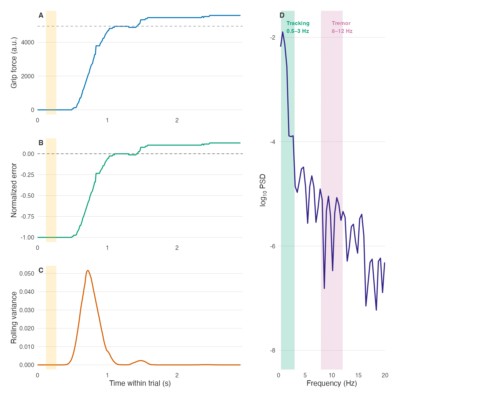
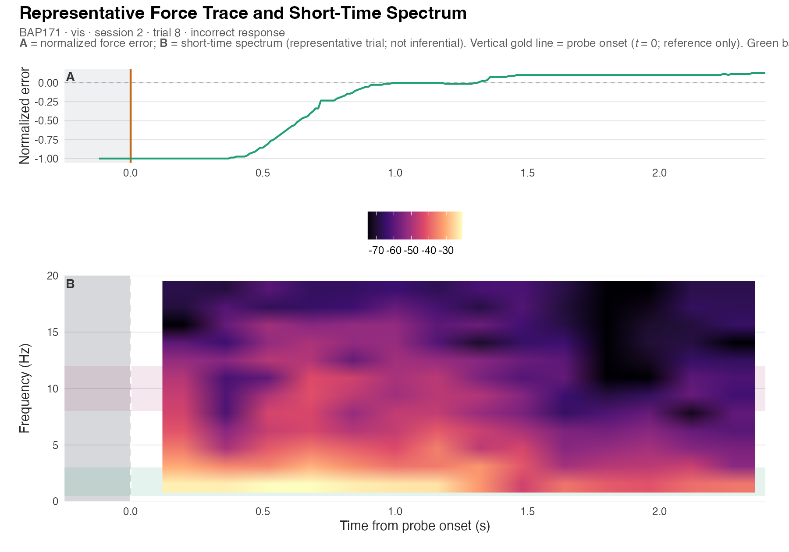
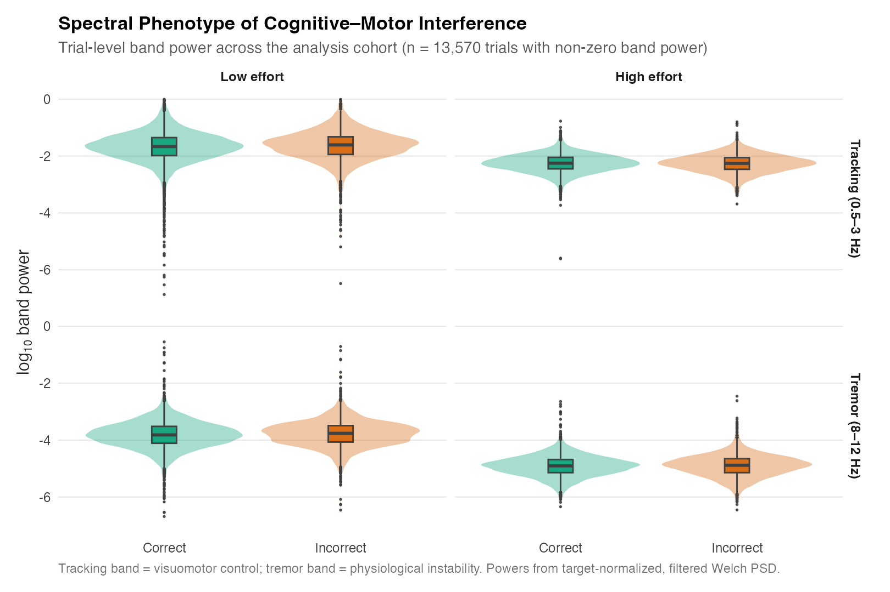
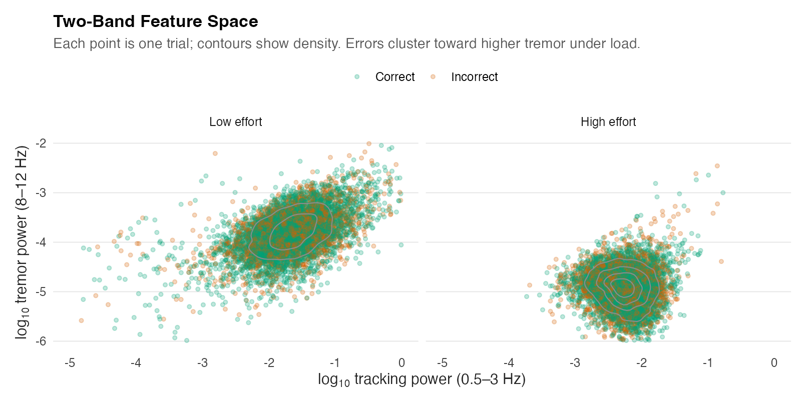
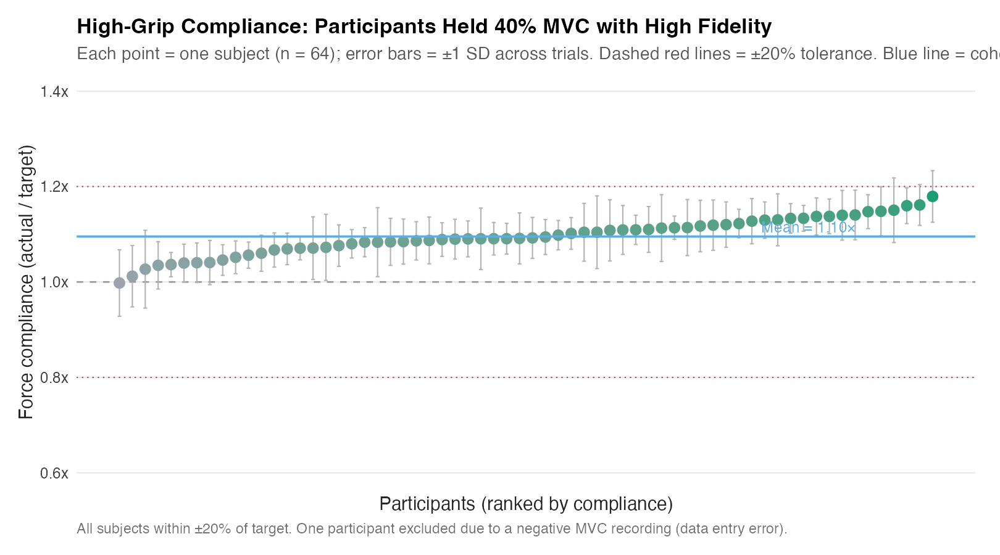
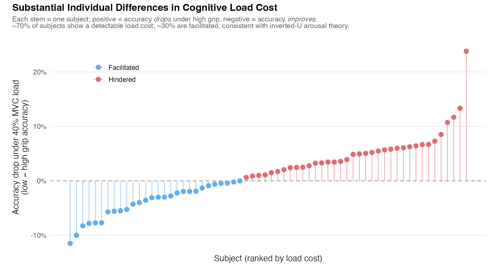
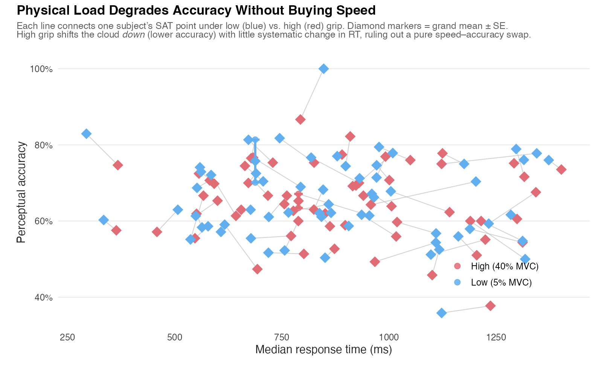
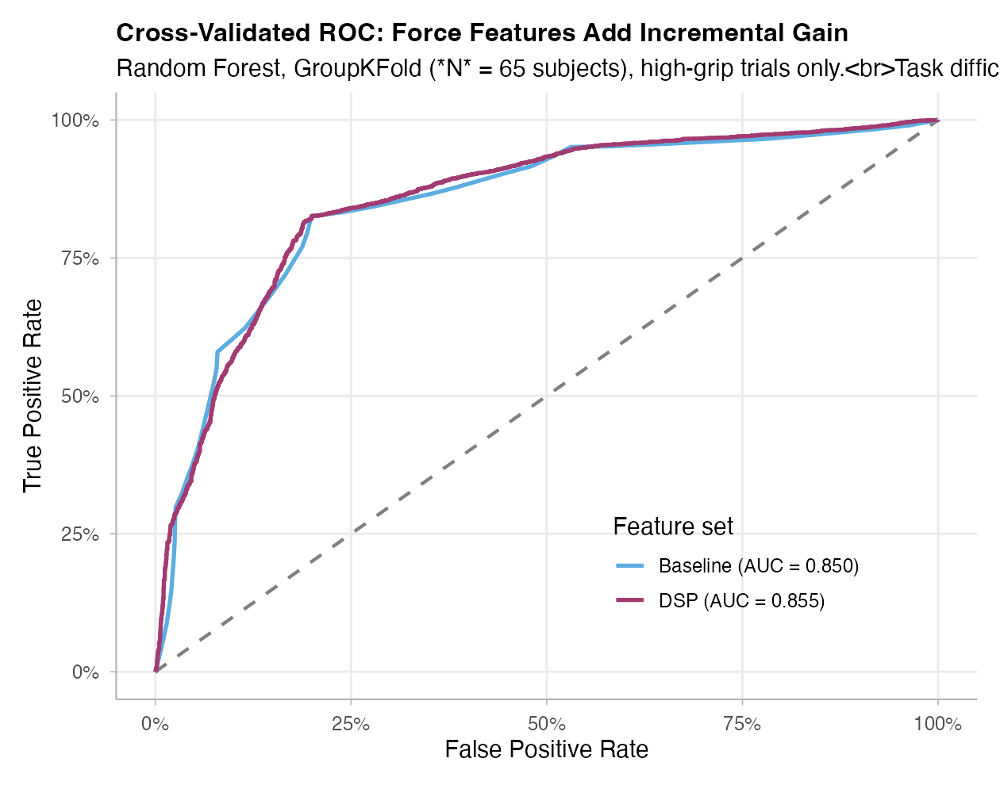
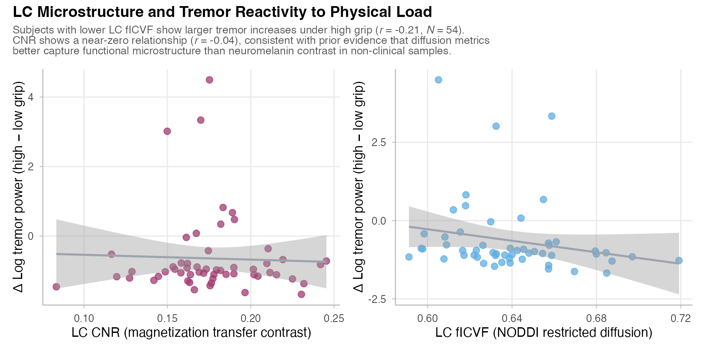

Main manuscript: [manuscript.qmd](manuscript.qmd) (HTML/PDF) · [manuscript-biorxiv.qmd](manuscript-biorxiv.qmd) (bioRxiv preprint PDF)

```{r}
#| label: supp-setup
#| include: false

suppressPackageStartupMessages(library(dplyr))
repo <- normalizePath("..", winslash = "/", mustWork = TRUE)
```

# Signal processing and feature extraction {#sec-supp-dsp}

Grip-force preprocessing followed the pipeline documented in the main Methods and in `analysis/01_ingest.qmd`:

1. Target-normalized error: $e(t) = (F(t) - F_\text{target}) / F_\text{target}$
2. Linear detrending within each trial epoch
3. Fourth-order zero-phase Butterworth high-pass filter at 0.5 Hz (`sosfiltfilt`)
4. Welch PSD estimation (Hann window, 50% overlap, ~0.5 Hz resolution)
5. Band integration: visuomotor tracking (0.5–3.0 Hz) and physiological tremor (8.0–12.0 Hz)

Epochs spanned grip-cue onset through 1 s after probe onset. All spectral features were log-transformed before modeling.

# Model specifications {#sec-supp-models}

**Mixed-effects logistic regression.** Perceptual accuracy was modeled as:

$$\text{logit}\, P(\text{correct}) = \beta_0 + \beta_1 \text{modality} + \sum_{k=1}^{4} \beta_{k} \text{poly}_k(\text{difficulty}) + \beta_5 z(\text{tracking}) + \beta_6 z(\text{tremor}) + u_i$$

where $u_i \sim \mathcal{N}(0, \sigma^2)$ is a random intercept for participant $i$, and $z(\cdot)$ denotes within-condition standardized band power. Primary inference used high-grip trials only (40% MVC); low-grip models used the same structure.

**Cross-validated machine learning.** Random-forest and logistic classifiers were trained with subject-wise cross-validation (leave-one-subject-out) on high-grip trials. Feature sets compared:

- **Baseline:** stimulus difficulty level, task modality
- **DSP:** baseline features plus tracking- and tremor-band power

Performance was evaluated using area under the ROC curve (AUC).

```{r}
#| label: tbl-supp-auc
#| echo: false
#| tbl-cap: "Cross-validated AUC for perceptual accuracy prediction (high-grip trials)."

repo <- normalizePath("..", winslash = "/", mustWork = TRUE)
auc <- read.csv(file.path(repo, "reports", "ml_auc_summary.csv"))
auc_out <- auc |>
  mutate(AUC = sprintf("%.4f", auc)) |>
  select(`Feature set` = feature_set, Model = model, AUC, `N trials` = n)
knitr::kable(auc_out, align = c("l", "l", "r", "r"))
```

# Sample coverage and attrition {#sec-supp-coverage}

```{r}
#| label: tbl-supp-attrition
#| echo: false
#| tbl-cap: "Grip-force data attrition funnel from behavioral oddball tasks to analysis-ready trials."

funnel <- read.csv(file.path(repo, "reports", "grip_attrition_funnel.csv"))
funnel_out <- funnel |>
  mutate(
    `Trials` = ifelse(is.na(n_trials), "—", format(n_trials, big.mark = ",")),
    `% retainable` = ifelse(is.na(pct_of_retainable_beh), "—", sprintf("%.1f%%", pct_of_retainable_beh))
  ) |>
  select(Stage = stage, `Subject-tasks` = n_subject_tasks, Trials, `% retainable`, Note = note)
knitr::kable(funnel_out, align = c("l", "r", "r", "r", "l"))
```

# Additional figures and tables {#sec-supp-figures}

**Single-trial signal chain.** Representative high-grip incorrect trial showing the transformation from raw force to normalized error, rolling variance, and Welch PSD with analysis bands marked.

{#fig-supp-anatomy width=95%}

**Representative force trace and short-time spectrum.** Normalized error and time–frequency power from a representative high-grip incorrect trial; probe onset is marked at *t* = 0 for reference (inferential features use the full trial epoch).

{#fig-supp-spectrogram width=90%}

**Population spectral distributions.**

{#fig-supp-spectral-fingerprint width=90%}

{#fig-supp-feature-space width=90%}

**Manipulation checks and individual differences.**

{#fig-supp-compliance width=85%}

{#fig-supp-caterpillar width=90%}

{#fig-supp-sat width=85%}

**Tremor-band power and perceptual accuracy.**

{#fig-supp-tremor-lift width=85%}

**Predictive modeling and brain–behavior.**

{#fig-supp-ml-roc width=80%}

{#fig-supp-lc-behavior width=90%}

**Full fixed-effects table.**

```{r}
#| label: tbl-supp-glmer
#| echo: false
#| tbl-cap: "Complete fixed-effects tables for baseline and DSP-augmented models (high-grip trials; post-outlier-screen, |tremor z| ≤ 3.5)."

source(file.path(repo, "R", "manuscript_glmer_table.R"))
fx <- build_high_grip_fx_table(file.path(repo, "reports", "analysis_trial_table.csv"))
knitr::kable(fx, align = c("l", "l", "r", "r"))
```

# Spectral Outlier Robustness {#sec-supp-sensitivity}

The primary analysis excluded trials whose tremor-band power z-score (computed within each grip arm) exceeded ±3.5 SD. Accuracy labels were not used in defining this screen. The table below shows results under four alternative screening rules to assess sensitivity of the main finding.

```{r}
#| label: tbl-supp-sensitivity
#| echo: false
#| tbl-cap: "Sensitivity of the high-grip DSP model to alternative spectral outlier screens. Tremor OR and 95% CI from the DSP-augmented mixed-effects logistic model; LRT p compares the DSP-augmented vs. baseline model. The primary analysis (|z| > 3.5) is shown in bold."

sens <- read.csv(file.path(repo, "reports", "sensitivity_outlier_screen.csv"), check.names = FALSE)
# Add primary marker
sens$`Outlier rule` <- ifelse(
  grepl("3\\.5", sens$`Outlier rule`) & grepl("Exclude", sens$`Outlier rule`),
  paste0("**", sens$`Outlier rule`, "** *(primary)*"),
  sens$`Outlier rule`
)
sens$`95% CI` <- sprintf("[%.2f, %.2f]", sens$`95% CI lo`, sens$`95% CI hi`)
out <- sens[, c("Outlier rule", "N removed", "N trials", "Tremor OR", "95% CI", "Tremor p", "LRT p")]
knitr::kable(out, align = c("l", "r", "r", "r", "c", "c", "c"))
```

**Interpretation:** The negative tremor-accuracy association is statistically significant across all four screening approaches, including no-removal (winsorization) and more or less aggressive exclusion thresholds. The no-screen model (OR = 0.96, LRT *p* = .447) shows that the 23 removed high-grip trials exerted high leverage: their extreme x-values (max *z* ≈ 48.5) with moderate accuracy pulled the slope toward zero. Their removal is justified on physiological grounds — no isometric grip-force epoch should produce tremor-band power 48 SD above the population mean — independent of accuracy outcomes.

**Outlier distribution:** The `r 23` removed high-grip trials came from `r 4` participants (BAP139, BAP166, BAP171, BAP176; IDs shown here for reproducibility), distributed across both auditory (*n* = 12) and visual (*n* = 11) modalities, suggesting scattered recording artifacts rather than a single systematic run failure.

# Reproducibility {#sec-supp-repro}

Analysis notebooks live in `analysis/`:

| Notebook | Purpose |
|---|---|
| `01_ingest.qmd` | Trial table construction and spectral feature extraction |
| `02_cognitive_motor_model.qmd` | Mixed-effects models and LC brain–behavior analyses |
| `03_hero_visuals.qmd` | Figure generation for manuscript and portfolio |

Render from the repository root:

```bash
quarto render analysis/01_ingest.qmd
quarto render analysis/02_cognitive_motor_model.qmd
quarto render analysis/03_hero_visuals.qmd
quarto render manuscript/manuscript.qmd
quarto render manuscript/manuscript-biorxiv.qmd --to biorxiv-typst
quarto render manuscript/supplementary.qmd
```

Local data paths are configured in `config/paths.local.yaml` (not tracked in git).
